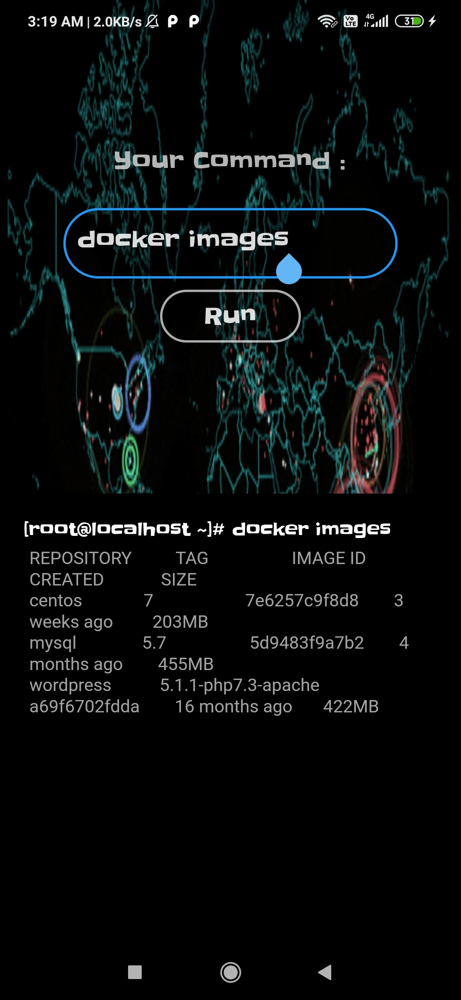

# LinuxGun_Flutter_Mode 

 <h1> </h1>
<b>
Integration with Linux by the help of the Python CGI...and For storing the output data and records of the commands by using the Firebase as DataBase !!!!

In Future I will add some more features......
</b>
# Screenshots :-
            
